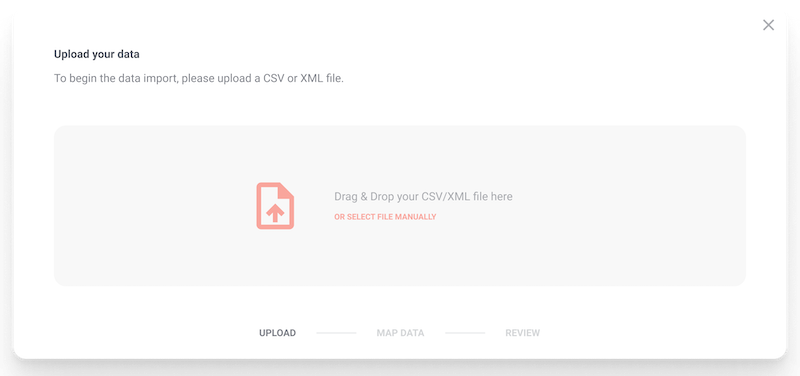

#  gluestick by hotglue
<p>
  <a href="https://1c1dl.csb.app"></a>
  <a href="https://docs.gluestick.xyz"></a>
  <a href="https://bit.ly/2KBGGq1"></a>
  <a href="https://www.npmjs.com/package/gluestick-elements"></a>
  <a href="https://hub.docker.com/r/hotglue/gluestick-api"></a>
</p>

Open source, self-hosted CSV uploads and mapping.

---

[](https://1c1dl.csb.app)

## Info

### Motivation
We want to provide a light-weight and simple way to integrate user data from CSVs, with a great UI and strong mapping functionality. 

### Links
- [Homepage](https://gluestick.xyz)
- [Documentation](https://docs.gluestick.xyz)
- [Source](https://github.com/hotgluexyz/gluestick)
- [Issues](https://github.com/hotgluexyz/gluestick/issues)
- [Slack](https://bit.ly/2KBGGq1)

### Sandbox
- [CodeSandbox Demo](https://1c1dl.csb.app)
- [CodeSandbox Sample](https://codesandbox.io/s/gluestick-demo-1c1dl)

## gluestick-elements

Simple reusable React components that handle CSV uploads, mapping, and validation.

### Functionality
1. Upload file
2. Do column mapping
3. Validate data + preview final output
4. Approve (sent to hook / piped to target)

### Install

```bash
npm install --save gluestick-elements
```

### Usage

```jsx
import React, { Component } from 'react'

import {GlueStick} from 'gluestick-elements'
import 'gluestick-elements/dist/index.css'

class Example extends Component {
  render() {
    return (<GlueStick
      user={"default"}
      endpoint={"https://gluestick-api.herokuapp.com"}
      schema={{
        fields: [
          {
            col: "Name",
            key: "name"
          },
          {
            col: "Phone Number",
            key: "phoneNumber",
            validator: /^(\+\d{1,2}\s)?\(?\d{3}\)?[\s.-]?\d{3}[\s.-]?\d{4}$/
              .source
          }
        ]
      }}
    />);
  }
}
```

## gluestick-api

A Python + Docker based mapping API that leverages data science tools to manipulate CSVs. This part is designed to be self-hosted and also benefits from being completely open source.

### Features

1. Handle all gluestick elements requests (all data is processed via Python backend not in browser)
2. Deployable to the cloud (Heroku, AWS, etc.)
3. Ability to connect with and pipe data directly to all targets supported by hotglue (S3, Cloud Storage, etc.)
4. Webhook functionality to programmatically monitor user uploads and make actions based on that
